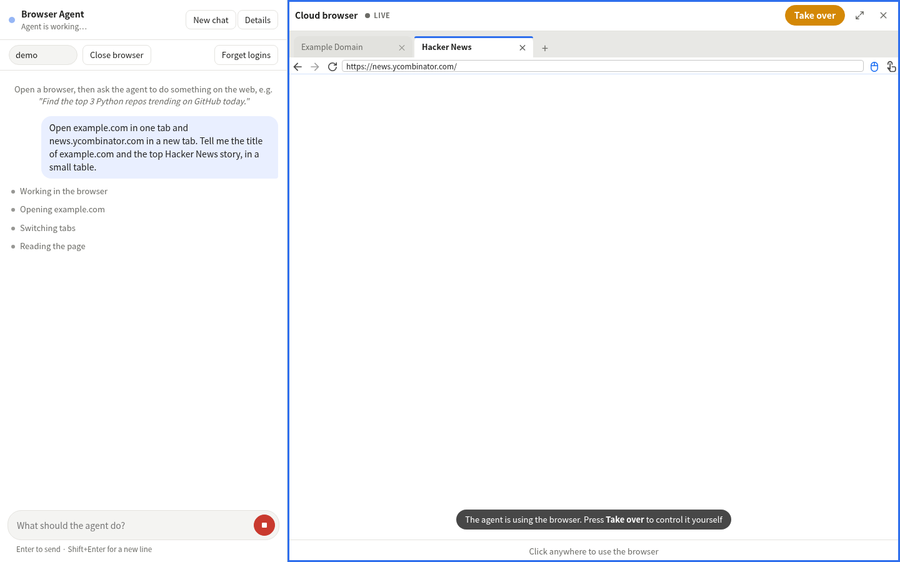

# Provider: local Docker Chromium (`PROVIDER=docker`)

A real headless Chromium in a container on your machine, one per user session. No account, no cloud, no per-minute cost.
Good for development, demos and anywhere browsing must stay on your own hardware.

| | |
|---|---|
| Saved logins | a Docker **volume** mounted at `/data` as Chromium's user-data directory: cookies, localStorage, IndexedDB and open tabs |
| Agent connection | `ws://<container>:8080/cdp/devtools/browser/<id>` over the shared `cba-net` network, no credentials |
| Live view | our screencast viewer (`ui/viewer/screencast.html`) fed by a WebSocket bridge in the control plane (`control/live_bridge.py`) |
| Tabs | Chromium's own `/json/list`, `/json/new`, `/json/close`; the UI draws the tab strip |
| Hide the agent while typing secrets | not available; the agent's pause gate stops it |
| Status | **Verified live:** open about 0.5 s, release about 1.2 s, cookies, localStorage and the open tab survive a release and reopen; a two-tab agent task ran end to end |



## Set up

Only Docker and an OpenAI key (`OPENAI_API_KEY` in the repo-root `.env`) are needed.

```bash
./run.sh docker          # builds the cba-chromium image the first time, then starts everything
```
Open http://localhost:8100. Stop with `./run.sh stop`.

## How it works

- **One container per session**, named `cba-browser-<id>` and labelled `cba.managed`, started by the control plane through the
  Docker socket from the `cba-chromium` image (`browsers/chromium/`): headless Chromium plus an nginx proxy that exposes only
  `/cdp/` (Chromium accepts DevTools connections for `Host: localhost` only, so nginx rewrites it).
- **Clean shutdown matters.** Chromium only flushes cookies and site data when it quits in an orderly way; `SIGTERM` skips the
  flush (a cookie set seconds earlier was lost in testing). The image's `start.sh` asks Chromium to quit through CDP
  (`Browser.close`) and waits, so `docker stop` (with a 30 s grace period) saves everything. A crash or `kill -9` can lose up
  to about 30 s of cookie changes.
- **A browser-wide policy** (`browsers/chromium/chromium-policy.json`, `RestoreOnStartup: 1`) keeps session cookies (logins with
  no expiry) and reopens the previous tabs.
- **The profile volume** is created before the session (`profile_at_start`) and reused. "Forget logins" deletes it.
- **Limits:** at most `DOCKER_MAX_BROWSERS` (default 5) running at once, 1 GB of memory and 512 processes each.

## Settings

| Variable | Default | |
|---|---|---|
| `DOCKER_BROWSER_IMAGE` | `cba-chromium` | image to start per session |
| `DOCKER_NETWORK` | `cba-net` | network shared with the agent (the compose file creates it) |
| `DOCKER_MAX_BROWSERS` | `5` | concurrent browsers |
| `DOCKER_BROWSER_MEMORY` | `1g` | memory limit per browser |

## Security

The control plane mounts `/var/run/docker.sock`, which is root on the host. That is fine on a laptop and **not** for a shared
or internet-facing server. The live bridge and the API have no login yet and are bound to `127.0.0.1`.

## Check it works

```bash
./run.sh docker
cloud_browser_agent/tests/run_live.sh docker
```
Expect `RESULT: PASS`: a cookie and a localStorage value set in one session are back after release and reopen.
